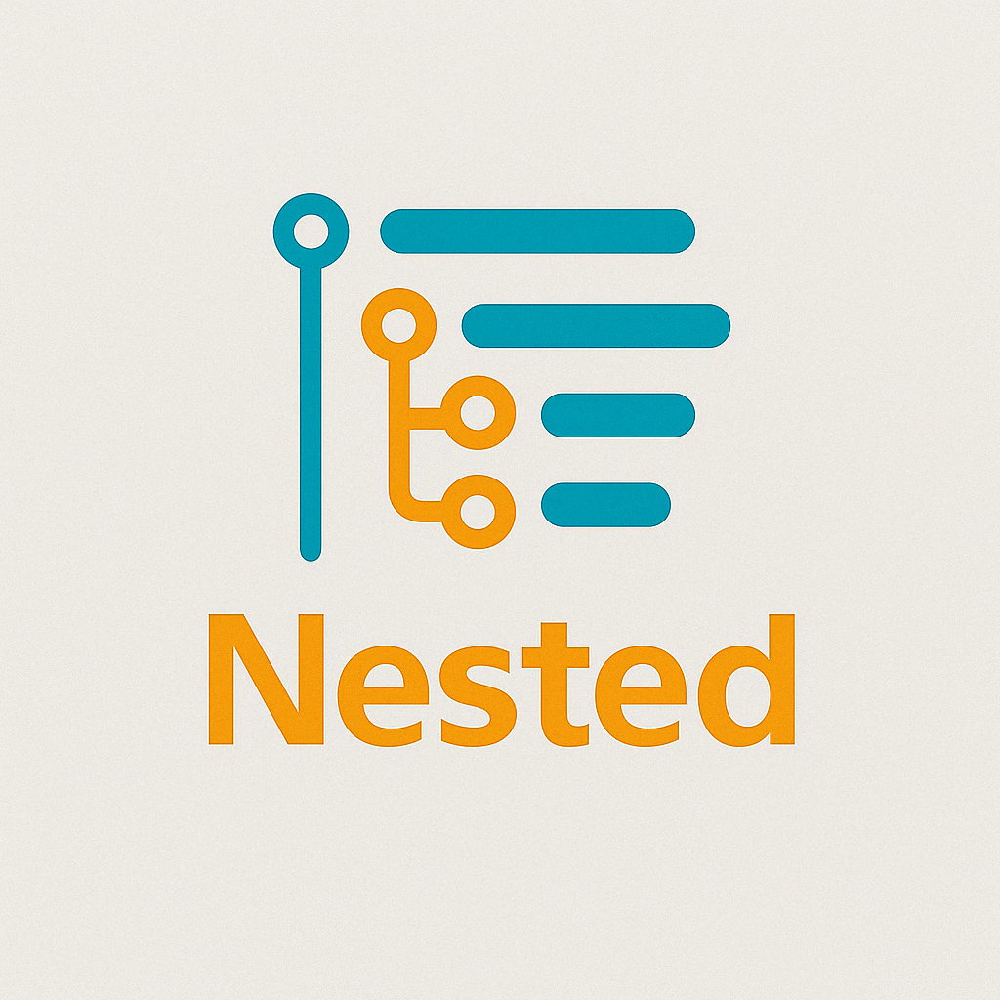

# Nested

**Nested** is a VS Code extension designed to make working with **Markdown** files easier. With **Nested**, you can quickly **nest and un-nest items** in your Markdown documents by adding or removing **4 spaces** at the beginning of selected lines.

### Key Features:
- **Add 4 spaces** to the beginning of the selected lines to **nest** items.
- **Remove 4 spaces** from the beginning of the selected lines to **un-nest** items.
- **Keyboard shortcuts** for both actions:
  - **Add indentation**: `Ctrl+Shift+Space` (Windows/Linux) or `Cmd+Shift+Space` (Mac)
  - **Remove indentation**: `Ctrl+Shift+Backspace` (Windows/Linux) or `Cmd+Shift+Backspace` (Mac)
- Ideal for **Markdown lists**, **headings**, and organizing content.

### Installation:

#### **Option 1: Install from the VS Code Marketplace**
1. Search for **"Nested"** in the [VS Code Marketplace](https://marketplace.visualstudio.com/).
2. Click **Install**.

#### **Option 2: Install Directly from GitHub**
1. Download the latest `.vsix` package from the [GitHub Releases page](https://github.com/yourusername/nested/releases).
2. In VS Code, open the **Command Palette** (`Ctrl+Shift+P` or `Cmd+Shift+P` on macOS).
3. Search for **"Install from VSIX..."**.
4. Select the downloaded `.vsix` file to install the extension.

### Usage:

- **Add indentation (4 spaces)**:
  1. Select the lines you want to indent.
  2. Press **Ctrl+Shift+Space** (or **Cmd+Shift+Space** on macOS) or use the **Add 4 Spaces to Selected Lines** command in the **Command Palette**.

- **Remove indentation (4 spaces)**:
  1. Select the lines you want to un-indent.
  2. Press **Ctrl+Shift+Backspace** (or **Cmd+Shift+Backspace** on macOS) or use the **Remove 4 Spaces from Selected Lines** command in the **Command Palette**.

### Example Use Cases:
- **Markdown lists**: Nest or un-nest items in bullet-point or numbered lists.
- **Headings**: Adjust nested headings in Markdown documents.
- **Code blocks**: Quickly indent or un-indent code or inline code sections.

### License:
This extension is licensed under the MIT License.

### Contributing:
If you'd like to contribute to **Nested**, feel free to fork the repository and submit a pull request!